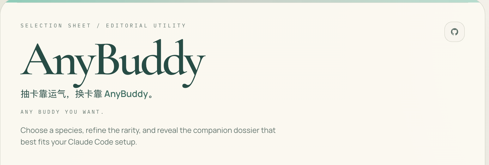
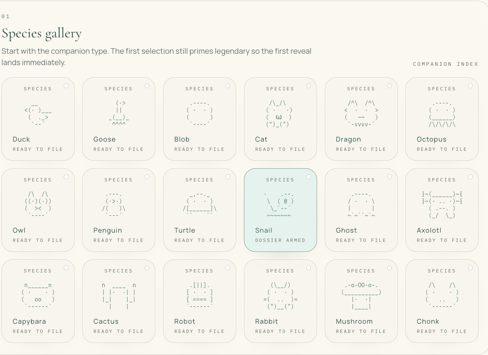

<p align="center">
  
</p>

<p align="center">
  <a href="README.MD">简体中文</a> | <strong>English</strong>
</p>

# AnyBuddy: Pick the Claude Code Buddy You Actually Want

Rolling buddies is luck. Picking buddies is AnyBuddy.

Any Buddy You Want.

Choose your Claude Code buddy by `species` and `rarity`, find a matching `user ID`, then apply it from the web or CLI.

Website: **[anybuddy.cc](https://anybuddy.cc)**

<p align="center">
  
</p>

## Core Value

- Get the exact Claude Code buddy you want, no more re-rolling.
- Search directly by `species + rarity`.
- Browse on the web, or apply with the CLI in one command.

## Get Started

Pick a buddy on the website, or try the CLI right away:

```bash
npx @openlor/anybuddy --list
npx @openlor/anybuddy --species duck --rarity legendary
```

Already picked a target `species` and `rarity` on AnyBuddy? Apply it locally:

```bash
npx @openlor/anybuddy --species turtle --rarity legendary
```

## What is AnyBuddy

AnyBuddy is a tool that helps you choose a Claude Code buddy. You can browse all available results by species and rarity, find the one you like, and get the corresponding `user ID`.

It's for two kinds of people:

- Those who want to lock in a specific `Claude Code buddy`
- Those who found a buddy on the website and want to bring it to their local CLI

## Why Would Anyone Need This

Claude Code's `/buddy` result isn't hand-picked -- most of the time it's more like drawing from a pool of candidates. AnyBuddy turns that into a controlled selection process.

If any of these sound like you, this tool fits:

- You want a specific species, not a random draw
- You want a specific rarity, like legendary or epic
- You found an exact buddy variant on the web and want to bring it back locally
- You're looking for something closer to a `buddy reroll` entry point, instead of guessing

## How It Works

Claude Code uses `wyhash` with your `user ID` and a global `salt` as the seed to assign buddies. AnyBuddy pre-generates a lookup table, so you can search by `species + rarity` and get a matching `user ID`.

Everything runs in the browser -- no external service needed.

## Use Cases

- Lock in a legendary duck instead of re-rolling every time.
- Found an exact variant on the website? Apply it to your local Claude config instantly.
- Prefer terminal workflows? Go from web lookup to CLI execution seamlessly.

## CLI

`anybuddy` is a one-click Claude Code buddy configurator. It finds a matching `user ID` based on your chosen `species` and `rarity`, then applies it to your local Claude configuration.

Requirements:

- Node.js 18 or newer
- Claude Code CLI installed: `npm install -g @anthropic-ai/claude-code`

Common commands:

```bash
npx @openlor/anybuddy --list
npx @openlor/anybuddy --species dragon --rarity epic
npx @openlor/anybuddy --help
```

For the full CLI walkthrough and release notes, see [packages/cli/README.md](packages/cli/README.md).

## FAQ

### What is AnyBuddy?

AnyBuddy is a tool that makes it easier to choose a Claude Code buddy. It supports searching by `species` and `rarity`, and returns available `user ID`s.

### Can AnyBuddy specify a Claude Code buddy?

Yes. Its core goal is to let you find the buddy you want directly, instead of relying on luck.

### Is AnyBuddy a Claude Code buddy reroll tool?

You can think of it as a reroll helper, but more precisely it's a selection and lookup tool, not just a "re-draw".

### Why does choosing a buddy require a user ID?

Because Claude Code's buddy assignment logic is tied to the `user ID`. AnyBuddy finds a `user ID` that matches your target result, so you can reliably reproduce that buddy.

### How do AnyBuddy and the CLI work together?

Find the buddy you want on the website by `species + rarity`, then use the CLI to apply the matching `user ID` locally.

### What Claude Code config does AnyBuddy modify?

The CLI updates your `~/.claude.json` and persists `CLAUDE_CODE_OAUTH_TOKEN` in your shell rc file, so you can use `/buddy` directly afterward.

## Acknowledgements

Thanks to Linux.do user [nemomen](https://linux.do/u/nemomen) for the buddy reroll idea.

## License

MIT
